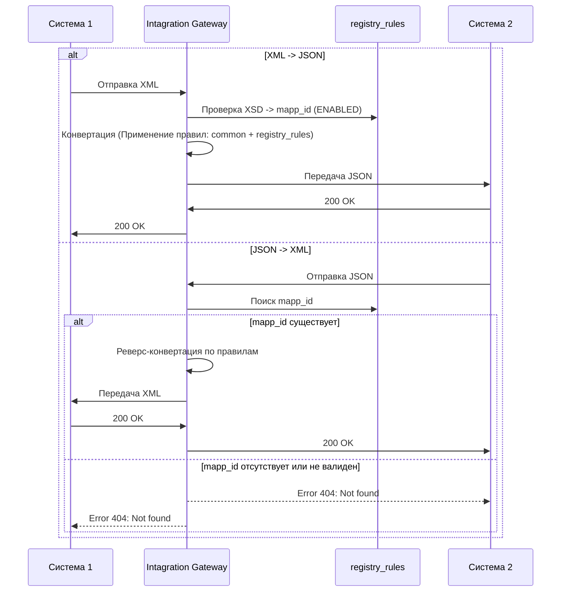

```mermaid
sequenceDiagram
    participant S1 as Система 1
    participant GW as Intagration Gateway
    participant DB as registry_rules
    participant S2 as Система 2

    alt XML -> JSON
        S1->>GW: Отправка XML
        GW->>DB: Проверка XSD -> mapp_id (ENABLED)
        GW->>GW: Конвертация (Применение правил: сommon + registry_rules)
        GW->>S2: Передача JSON
        S2 ->> GW: 200 OK
        GW ->> S1: 200 OK
    else JSON -> XML
        S2->>GW: Отправка JSON
        GW->>DB: Поиск mapp_id
        alt mapp_id существует
            GW->>GW: Реверс-конвертация по правилам
            GW->>S1: Передача XML
            S1 ->> GW: 200 OK
            GW ->> S2: 200 OK
        else mapp_id отсутствует или не валиден
            GW-->>S2: Error 404: Not found
            GW-->>S1: Error 404: Not found
        end
    end
```
