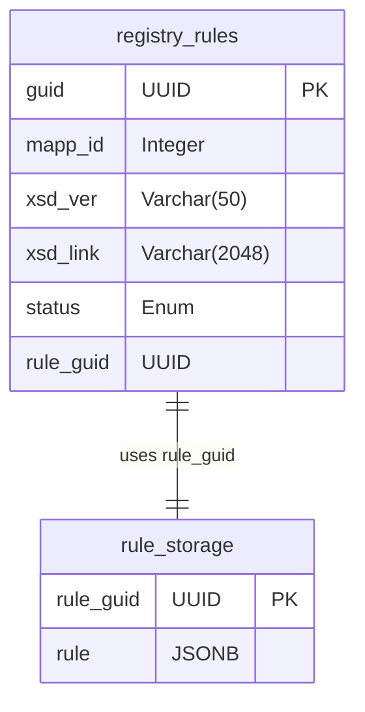

```mermaid
erDiagram
    registry_rules ||--|| rule_storage : "uses rule_guid"
    
   registry_rules {
         guid UUID PK
         mapp_id Integer
         xsd_ver Varchar(50)
         xsd_link Varchar(2048) 
         status Enum
         rule_guid  UUID
    }
    
    rule_storage {
        rule_guid UUID PK
        rule JSONB
    }
```
